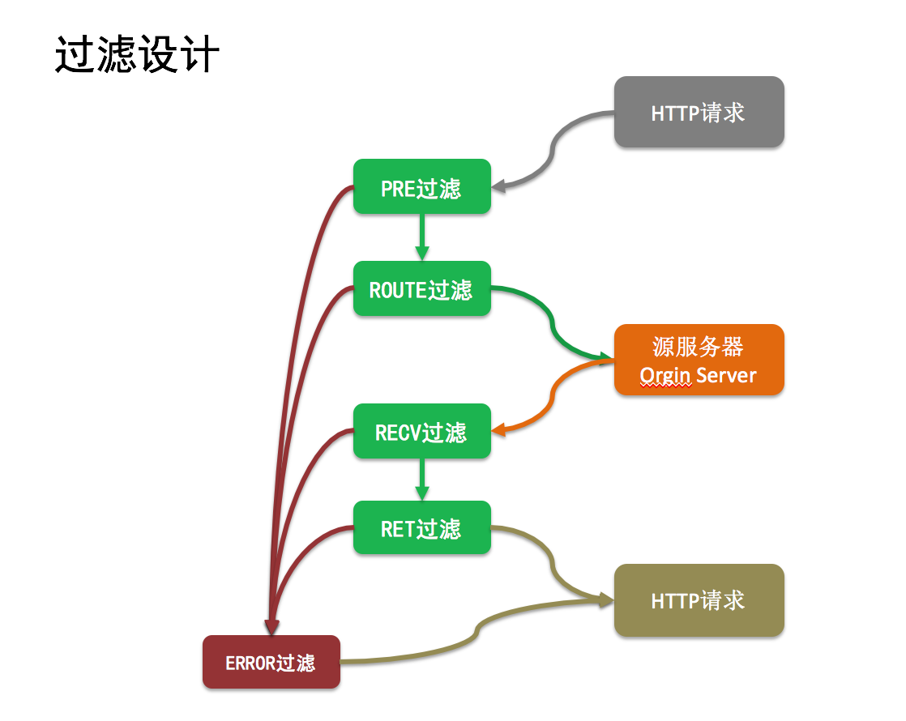

#微服务神经元(Nerver)

主要功能:过滤、动态规则路由、容错、熔断、隔离、限流、超时控制。

##一、过滤
###1.过滤类型
过滤规则(FilterType)参考了Netflix的Zuul项目进行实现,提供了以下五层过滤器:

+ PRE：请求到达Nerver服务器之前进行过滤
+ ROUTE：请求路由转发至源服务器(Orgin Server)之前进行过滤
+ RECV：请求从Orgin Server回来到达Nerver服务器之前过滤
+ RET：请求从Nerver服务器离开之前(响应用户)进行过滤
+ ERROR：当请求在Nerver服务器中发送异常时进行过滤

###2.过滤设计方案
  

##二、动态规则路由
###1.路由规则
	如:
	/api/goods/** → http://127.0.0.1:8081/api/goods
	/api/user/** → http://127.0.0.1:8082/api/user
	...

###2.路由实现
采用httpclient实现请求的转发(路由)。

###3.路由类型
目前已支持：GET、POST、PUT、DELETE、HEAD、OPTIONS、PATCH和TRACE类型请求的路由。

###4.使用示例
第一步：模拟启动待被路由的远程服务器

	/**
	 * 被路由的服务器
	 * @author lry
	 */
	public class OrginServer extends AbstractHandler {

	public void handle(String target, Request baseRequest, HttpServletRequest request, HttpServletResponse response) throws IOException, ServletException {
		request.setCharacterEncoding("UTF-8");
		response.setCharacterEncoding("UTF-8");
		response.setContentType("text/html; charset=UTF-8");
		response.setHeader("Content-Type", "text/html; charset=UTF-8");
		
		response.setStatus(HttpServletResponse.SC_OK);
		baseRequest.setHandled(true);
		
		response.getWriter().println("已经到达源服务器了!参数:"+JSON.toJSONString(request.getParameterMap()));
	}

	public static void main(String[] args) throws Exception {
		Server server = new Server(8081);
		server.setHandler(new OrginServer());
		server.start();
		System.out.println("源服务器启动成功");
		
		server.join();
	}
	}

第二步：启动微服务神经元服务器
	
	/**
	 * 微服务神经
	 * @author lry
	 */
	public enum Nervor {
	
	INSTANCE;
	public RouteModuler routeModuler=RouteModuler.INSTANCE;
	public IContainer container=null;
	
	public void start() {
		try {
			//添加路由规则
			routeModuler.addRouteRule(new RouteRule(0, true, "/api/get/**", "http://127.0.0.1:8081/api/get"));
			
			container=new JettyContainer();
			container.cstart(8080);
		} catch (Throwable t) {
			if(container!=null){
				container.cstop();
			}
			t.printStackTrace();
		}
	}
	
	public static void main(String[] args) throws Exception {
		INSTANCE.start();
	}
	}

第三步：打开浏览器访问

	http://127.0.0.1:8080/nerver/v1/api/get/123?name=nerver&data=123456
	其中“/nerver/v1”表示服务器名称和版本号

##三、容错
###1.使用场景
主要用于分布式系统之间进行交互的代码模块,即容错有依赖的代码模块。当分布式系统之间发生远程通信时，需要对代码模块实现容错处理(不保证事务的一致性)。

##四、熔断
###1.使用场景
在一定的时间窗内,当分布式远程通信中的某一条线路的失败率达到一定的阀值时,系统需要暂时断掉该条线路,以保证后续的服务质量。在熔断一定的时间后,需要尝试线路是否正常,正常则恢复熔断,否则周期性检查是否恢复。

##五、隔离
###1.使用场景
分布式服务在远程调用时,可为会发生未知的异常,进而可能会引起整个主服务进程都宕掉,则会导致大面积的服务瘫痪。为了防止单个服务依赖异常而引发其他服务一起陪葬的问题,需要对每一个远程依赖进行隔离。

##六、限流
###1.使用场景
当某一片区的服务整体失败率较高时,我们可以选择拒绝部分请求,从而防止该片区集体宕掉或下线的问题；或者使用与流量的迁移过程。

##七、超时控制
###1.使用场景
在分布式依赖的模块，为防止服务端长时间等待远程响应的结果，而使用超时设置来控制远程消费异常的情况。

